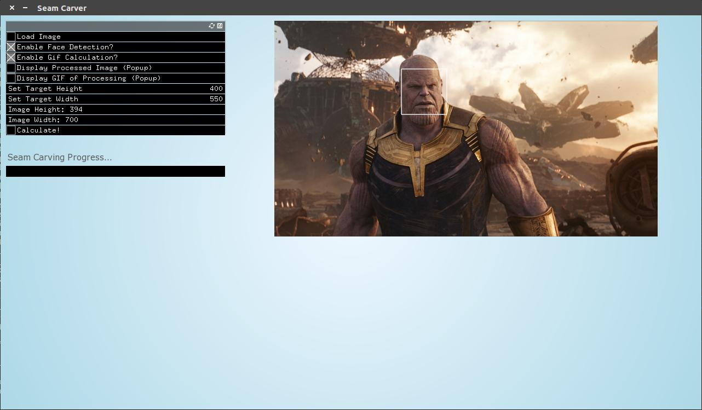
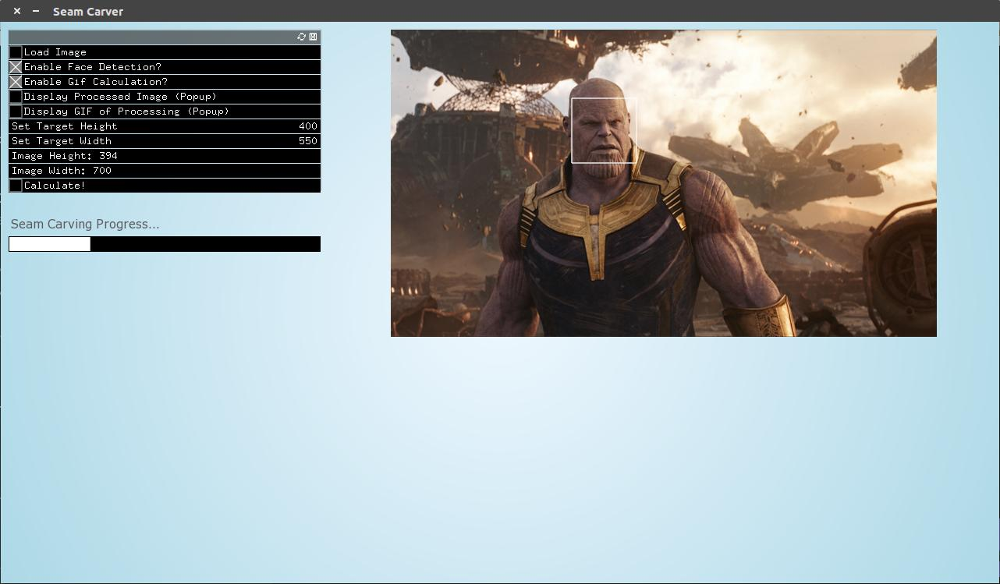

# Seam Carver
Seam Carver is an [openFrameworks](https://openframeworks.cc/) desktop application that performs various seam carving applications. 
It currently supports removing seams, adding seams, generating a GIF of the carving process, and face detection.

See the project [proposal](https://github.com/uiuc-fa18-cs126/finalproject-Bo887/blob/master/PROPOSAL.md) and [documentation](https://github.com/uiuc-fa18-cs126/finalproject-Bo887/blob/master/DEVELOPMENT.md) for more details.

### Dependencies:
  The only dependencies are openFramework addons. See [addons.make](https://github.com/uiuc-fa18-cs126/finalproject-Bo887/blob/master/addons.make) and [this link](https://openframeworks.cc/learning/01_basics/how_to_add_addon_to_project/) for more details.
  - [ofxGui](https://openframeworks.cc/documentation/ofxGui/) was used to create most of the graphical components in the windows. This should come with your installation of openFrameworks. All the other dependencies need to be manually downloaded.
  - [ofxCv](https://github.com/kylemcdonald/ofxCv) was used to enable face detection.
      - Note: I had an issue initially with building ofxCV, and applied [this](https://github.com/openframeworks/openFrameworks/issues/6012) fix.
      - Note: [ofxOpenCv](https://openframeworks.cc/documentation/ofxOpenCv/) was not actually used in any way, but for whatever reason, I needed to add it to my [addons.make](https://github.com/uiuc-fa18-cs126/finalproject-Bo887/blob/master/addons.make) for ofxCv to compile properly.
  - [ofxGif](https://github.com/Geistyp/ofxGif) was used to create, save, and load gifs.
  - [ofxProgressBar](https://github.com/atduskgreg/ofxProgressBar) was used to create the loading bar in the main winow.

### Steps to run:
  1. [Install openFrameworks](https://openframeworks.cc/download/).
  2. Install [dependencies](https://github.com/uiuc-fa18-cs126/finalproject-Bo887/blob/master/README.md#dependencies).
      - Clone the Github repositories of the non-official addons (ofxCv, ofxGif, ofxProgressBar) to your ```OF_ROOT/addons``` directory. Make sure they are also all added in [addons.make](https://github.com/uiuc-fa18-cs126/finalproject-Bo887/blob/master/addons.make).
  3. Make sure the configurations in [config.make](https://github.com/uiuc-fa18-cs126/finalproject-Bo887/blob/master/config.make) are set properly (specifically make sure [OF_ROOT](https://github.com/uiuc-fa18-cs126/finalproject-Bo887/blob/master/config.make#L11) actually points to the root directory of your openframeworks installation.
  4. Build the application by running ```make``` in the project root directory. You should now see output from the project building.
  5. Run the application by running ```make RunRelease``` in the project root directory. The main application window should now open.
  
### Screenshots:
  Here are some screenshots of the main window.
  
  <p align="center">
    
    
  </p>
  
  Here is a comparison of the original image to the carved image. The original was ```700x394```, and the carved is ```550x400```.
  
  <p align="center">
    
    
  </p>
      
  Here is a gif showing the seam carving process of the above image.
    <p align="center">
      
    </p>
    
  Here is a comparison of an image carved with (right) and without (left) face detection, with the original image (top) shown. When face detection is enabled, the seam carving algorithm will not choose any seams that intersect with the detected face. Although the carved image with face detection is not perfect, it looks much better than the one without face detection.
    
  <p align="center">
    
    
    
  </p>

#### Contributors:
  - Eric Zhang
